# Claude Task Manager

A specialized tool to manage context isolation and focused task execution with Claude Code, solving the critical challenge of context length limitations and task focus when working with Claude on complex, multi-step projects.

## What is Claude Task Manager?

Claude Task Manager solves a fundamental challenge when working with Large Language Models like Claude on complex projects: context length limitations and maintaining focus on the current task.

### The Problem

When working with Claude Code (or any LLM) on complex projects, you typically face several challenges:

1. **Context Length Limitations**: Claude has a limited context window. Long, complex projects can exceed this limit.
2. **Task Switching Confusion**: When handling multiple tasks in a single conversation, Claude may get confused about which task it's currently working on.
3. **Project Organization**: Large projects need structure and organization to track progress.
4. **Effective Prompting**: Each task requires specific, focused instructions to get optimal results.

### The Solution

Claude Task Manager implements a "Boomerang" approach:

1. **Task Breakdown**: It analyzes a large project specification and intelligently breaks it down into smaller, self-contained tasks.
2. **Context Isolation**: Each task is executed in a clean context window, ensuring Claude focuses solely on that task.
3. **Project Organization**: Tasks are organized into projects with proper sequencing and metadata.
4. **Execution Management**: Tasks can be run individually or in sequence, with results captured and organized.

## Why Use Claude Task Manager?

- **Overcome Context Limitations**: Break down large projects into manageable chunks that fit within Claude's context window.
- **Maintain Focus**: Ensure Claude stays focused on the current task without being distracted by previous context.
- **Improve Quality**: Get better results by providing Claude with clear, focused instructions for each task.
- **Organize Complex Projects**: Manage multi-step projects with proper structure and sequencing.
- **Track Progress**: Monitor task completion and project status.
- **MCP Integration**: Seamlessly integrate with agent workflows through the Model Context Protocol.

## Prerequisites

This package requires the following to be installed on your system:

1. **Claude Desktop** - You need to have Claude Desktop application installed
2. **Claude Code** - The `claude` command-line tool must be accessible in your PATH
3. **Desktop Commander** - Required for file system access (see installation instructions below)

### Installing Desktop Commander

Desktop Commander is a critical dependency that enables Claude to access your file system and execute commands. To install:

```bash
# Using npx (recommended)
npx @wonderwhy-er/desktop-commander@latest setup

# Or using Smithery
npx -y @smithery/cli install @wonderwhy-er/desktop-commander --client claude
```

For more details, visit the [Desktop Commander website](https://desktopcommander.app/#installation).

After installation, restart Claude Desktop and ensure you see the hammer icon in the chat interface, indicating that Desktop Commander is properly connected.

## Core Features

- **Task Breakdown**: Intelligently parse complex projects into focused, self-contained tasks
- **Context Isolation**: Execute each task with a clean context window using the `/clear` command
- **Project Management**: Organize tasks into projects with proper metadata and sequencing
- **Execution Control**: Run tasks individually or in sequence, with proper result management
- **Status Tracking**: Monitor project progress and task completion status
- **Modern CLI**: Intuitive command-line interface with rich formatting
- **MCP Integration**: Seamless integration with agent workflows via FastMCP

## Installation

```bash
# From claude_mcp_configs root directory:
python setup_libs.py task-manager

# Or install directly from the directory
cd libs/claude_task_manager
pip install -e .
```

The package uses modern Python packaging with pyproject.toml, making it compatible with the latest pip and build tools.

### Dependencies

For FastMCP integration, you'll need to install the `fastmcp` package:

```bash
pip install fastmcp
```

## Usage

### Basic Workflow

The typical workflow with Claude Task Manager involves:

1. **Create a project**: Set up a new project structure
2. **Break down tasks**: Convert a large task specification into smaller, self-contained tasks
3. **Run tasks**: Execute tasks individually or as a complete project
4. **Monitor progress**: Track task completion and project status

### Command Line Interface

```bash
# Create a new project
claude-tasks create-project my_project /path/to/task_list.md

# Break down a task into individual tasks
claude-tasks break-task my_project /path/to/task_list.md

# Run a single task
claude-tasks run-task my_project 001_first_task.md

# Run all tasks in a project
claude-tasks run-project my_project

# List available projects
claude-tasks list-projects

# List tasks in a project
claude-tasks list-tasks my_project

# Check project status
claude-tasks check-status my_project

# Get machine-readable schema (MCP-compatible)
claude-tasks schema

# Get MCP-compatible schema format
claude-tasks schema --mcp
```

#### MCP-Compatible Features

The CLI provides several MCP-compatible features:

1. **Machine-readable JSON output**:
   ```bash
   # Add --json to any command for structured JSON output
   claude-tasks list-tasks my_project --json
   ```

2. **Schema command**:
   ```bash
   # Get a complete JSON schema of all commands and parameters
   claude-tasks schema
   
   # Output in MCP format
   claude-tasks schema --mcp
   ```

3. **Consistent result structure**:
   All JSON outputs follow a consistent structure with:
   - `success` flag (boolean)
   - Command-specific result data
   - Error information when applicable
   
4. **Rich human-readable output**:
   When used without `--json`, commands provide well-formatted tables and panels

### Python API

```python
from claude_task_manager import TaskManager

# Initialize the task manager
manager = TaskManager('/path/to/base/directory')

# Create a new project
project_dir = manager.create_project('my_project', '/path/to/task_list.md')

# Break down a task into individual tasks
project_dir, created_files = manager.break_down_task('my_project', '/path/to/task_list.md')

# Run a single task
result_file = manager.run_task('my_project', '001_first_task.md')

# Run all tasks in a project
results = manager.run_project('my_project')

# List available projects
projects = manager.list_projects()

# List tasks in a project
tasks = manager.list_tasks('my_project')

# Check project status
status = manager.check_project_status('my_project')
```

### MCP Server

To run the Task Manager as an MCP server:

```bash
# Start the server with default settings
python run_task_manager_server.py start

# Start with custom settings
python run_task_manager_server.py start --host 0.0.0.0 --port 5000 --base-dir /path/to/tasks --debug

# Run diagnostics
python run_task_manager_server.py diagnostic

# Output schema
python run_task_manager_server.py schema
```

The server exposes the following MCP functions:
- `create_project` - Create a new project
- `break_task` - Break down a task into individual task files
- `run_task` - Run a single task with context isolation
- `run_project` - Run all tasks in a project
- `list_projects` - List all projects
- `list_tasks` - List all tasks in a project
- `check_status` - Check project status

## How It Works

### Task Breakdown Process

When you provide a large task description, Claude Task Manager:

1. **Analyzes the content**: Uses Claude itself to understand the task structure
2. **Identifies logical divisions**: Determines natural breakpoints in the task
3. **Creates self-contained tasks**: Generates task files with all necessary context
4. **Establishes dependencies**: Determines the correct execution sequence
5. **Generates metadata**: Creates project information and execution plans

### Visual Workflow

The following diagram illustrates the complete workflow from task breakdown to execution:

```mermaid
flowchart TD
    %% Phase labels
    PhaseA[Task Breakdown Phase]:::phaseLabel
    PhaseB[Execution Phase]:::phaseLabel
    PhaseC[Context Isolation Mechanism]:::phaseLabel
    
    %% Task Breakdown Phase nodes
    A[📋 Original Task List] --> B[🧠 Claude Analysis]
    B --> C{✂️ Split into Tasks}
    C --> D[📑 Task 000: Project Overview]
    C --> E[📑 Task 001: First Subtask]
    C --> F[📑 Task 002: Second Subtask]
    C --> G[📑 Task 003: Third Subtask]
    D & E & F & G --> H[📋 Generate Task Sequence]
    
    %% Connect phases
    H --> I
    
    %% Execution Phase nodes
    I[🚀 Execute Task 000] --> J[🚀 Execute Task 001]
    J --> K[🚀 Execute Task 002]
    K --> L[🚀 Execute Task 003]
    
    %% Context Isolation for Task 000
    I --> I1[🧹 /clear Context]
    I1 --> I2[📥 Load Task 000]
    I2 --> I3[⚙️ Execute with Claude Code]
    I3 --> I4[💾 Save Results]

    %% Context Isolation for Task 001
    J --> J1[🧹 /clear Context]
    J1 --> J2[📥 Load Task 001]
    J2 --> J3[⚙️ Execute with Claude Code]
    J3 --> J4[💾 Save Results]

    %% Context Isolation for Task 002
    K --> K1[🧹 /clear Context]
    K1 --> K2[📥 Load Task 002]
    K2 --> K3[⚙️ Execute with Claude Code]
    K3 --> K4[💾 Save Results]

    %% Context Isolation for Task 003
    L --> L1[🧹 /clear Context]
    L1 --> L2[📥 Load Task 003]
    L2 --> L3[⚙️ Execute with Claude Code]
    L3 --> L4[💾 Save Results]

    %% Results collection
    I4 & J4 & K4 & L4 --> M[📊 Collect All Results]
    M --> N[✅ Complete Project]

    %% Place phase labels
    PhaseA -.-> A
    PhaseB -.-> I
    PhaseC -.-> I1
    
    %% Styling for light/dark mode compatibility
    classDef phase fill:#d8b4fe,stroke:#6b21a8,stroke-width:2px,color:#000;
    classDef task fill:#93c5fd,stroke:#1e40af,stroke-width:1px,color:#000;
    classDef result fill:#86efac,stroke:#166534,stroke-width:1px,color:#000;
    classDef isolation fill:#fef08a,stroke:#854d0e,stroke-width:1px,color:#000;
    classDef phaseLabel fill:none,stroke:none,color:#6b21a8,font-weight:bold,font-size:16px;

    class A,B,C phase;
    class D,E,F,G,H,I,J,K,L task;
    class I4,J4,K4,L4,M,N result;
    class I1,I2,I3,J1,J2,J3,K1,K2,K3,L1,L2,L3 isolation;
```



This diagram shows how:
1. A large task list is broken down into smaller, manageable tasks
2. Each task is executed in sequence
3. Context isolation is maintained by clearing Claude's context before each task
4. Results are collected and integrated into a complete project

#### Diagram Legend:

- **Task Breakdown Phase**:
  - 📋 Document/list operations
  - 🧠 Analysis processes
  - ✂️ Task splitting
  
- **Execution Phase**:
  - 🚀 Task execution
  
- **Context Isolation**:
  - 🧹 Context clearing
  - 📥 Content loading
  - ⚙️ Process execution
  - 💾 Result saving
  
- **Final Steps**:
  - 📊 Result collection
  - ✅ Project completion

### Context Isolation Mechanism

The key to Claude Task Manager's effectiveness is its context isolation mechanism:

1. **Clean context**: Each task starts with the `/clear` command, wiping Claude's context window
2. **Focused instructions**: The task file contains all necessary context and instructions
3. **Independent execution**: Tasks run without knowledge of other tasks
4. **Result capture**: Outputs are stored as separate result files

This approach ensures Claude maintains focus on the current task without being confused by previous instructions or outputs.

## Project Structure

```
/base_directory/
├── project_name/
│   ├── project.json          # Project metadata
│   ├── task_list.md          # Original task list
│   ├── task_sequence.txt     # Task execution sequence
│   ├── tasks/                # Individual task files
│   │   ├── 000_project_overview.md
│   │   ├── 001_first_task.md
│   │   └── ...
│   ├── results/              # Execution results
│   │   ├── 000_project_overview.result
│   │   ├── 001_first_task.result
│   │   └── ...
│   └── temp/                 # Temporary files
└── ...
```

## Three-Layer Architecture

The Task Manager implements a clean three-layer architecture:

1. **Core Layer**: The `TaskManager` class in `task_manager.py` provides the core business logic.
2. **Presentation Layer**: The CLI in `cli.py` handles user interaction and output formatting.
3. **Integration Layer**: The FastMCP wrapper in `fast_mcp_wrapper.py` connects the core functionality to the MCP ecosystem.

Each layer has a distinct responsibility, making the code more maintainable, testable, and adaptable.

## MCP Integration and Debugging

The Task Manager integrates with FastMCP to provide a Model Context Protocol (MCP) interface, allowing it to be used by AI agents. This section covers how to set up, use, and debug the MCP integration.

### Setting Up MCP Configuration

1. Add the Task Manager to your `.mcp.json` file:

```json
{
  "mcpServers": {
    "task_manager": {
      "command": "/path/to/python",
      "args": [
        "/path/to/run_task_manager_server.py",
        "start"
      ]
    }
  }
}
```

2. Place this file in your home directory or specify the path with the `MCP_CONFIG_PATH` environment variable.

### Debugging with MCP Inspector

The MCP Inspector is a powerful tool for debugging MCP servers. Follow these steps to debug the Task Manager MCP integration:

#### 1. Install MCP Inspector

```bash
git clone https://github.com/modelcontextprotocol/inspector.git
cd inspector
npm install
```

#### 2. Start the Task Manager MCP Server

In a separate terminal, start the Task Manager server:

```bash
python /path/to/run_task_manager_server.py start --debug
```

#### 3. Launch the MCP Inspector

```bash
cd /path/to/inspector
npm start
```

This will open the MCP Inspector in your browser, typically at http://localhost:3000.

#### 4. Connect to the Task Manager Server

In the MCP Inspector:
- Click "Connect to Server"
- Enter the URL (e.g., "http://localhost:3000" - the default for the Task Manager)
- Click "Connect"

#### 5. Explore Available Functions

Once connected, you'll see the available MCP functions. You can:
- See function descriptions, parameters, and return types
- Expand each function to see more details

#### 6. Test a Function

To test a function:
1. Click on the function name (e.g., "list_projects")
2. Fill in the required parameters
3. Click "Call Function"
4. View the function response

#### 7. Debug Common Issues

If you encounter issues, try these debugging steps:

##### Server Connection Issues

- Check that the server is running and accessible
- Ensure the port isn't in use by another application
- Look for error messages in the server's terminal output

##### Function Call Errors

- Examine the server logs to see detailed error messages
- Check for validation errors in your parameters
- Look for file system permission issues

##### Permission Problems

The most common issues relate to file system access:
- Ensure Desktop Commander is properly installed and running
- Check that the Task Manager has permission to access the specified directories
- Look for "Access denied" or similar error messages in the logs

##### MCP Format Issues

- Use the MCP Inspector to check the function schema
- Ensure parameter names and types match the schema
- Check that the function is registered correctly in the MCP wrapper

#### 8. Using MCP Schema for Debugging

The Task Manager provides a built-in schema command that can be helpful for debugging:

```bash
python run_task_manager_server.py schema > mcp_schema.json
```

You can then use this schema to:
- Compare against the schema reported by the MCP Inspector
- Validate your function calls
- Understand the expected parameters and return types

#### 9. Testing End-to-End Workflows

To test a complete workflow:

1. Create a project:
   - Call `create_project` with a name and optional source file
   - Check the return value for the project directory

2. Break down a task:
   - Call `break_task` with the project name and source file
   - Verify the created task files

3. Run tasks:
   - Call `run_task` or `run_project` to execute tasks
   - Check the results directory for output files

#### 10. Logging and Monitoring

For ongoing monitoring:
- Set the server to debug mode (`--debug` flag)
- Redirect logs to a file for analysis
- Use a tool like `tail -f logfile.log` to watch logs in real time

By following these steps, you can effectively debug and test the Task Manager MCP integration.

## Real-World Example

Let's say you have a complex project to build a recommendation system that requires:

1. Data analysis
2. Algorithm design
3. Implementation
4. Testing
5. Documentation

This would likely exceed Claude's context window if sent as a single task. With Claude Task Manager:

1. Create a project:
   ```bash
   claude-tasks create-project recommendation_system project_spec.md
   ```

2. Break down the task:
   ```bash
   claude-tasks break-task recommendation_system project_spec.md
   ```

3. Claude Task Manager breaks it into manageable tasks:
   - `000_project_overview.md` - Project summary and goals
   - `001_data_analysis.md` - Data exploration and insights
   - `002_algorithm_design.md` - Design of recommendation algorithm
   - `003_implementation.md` - Code implementation
   - `004_testing.md` - Test cases and validation
   - `005_documentation.md` - User and technical documentation

4. Run the entire project:
   ```bash
   claude-tasks run-project recommendation_system
   ```

Each task is executed in isolation, with Claude focusing solely on that specific task, ensuring high-quality results without context confusion.

## Requirements

- Python 3.7+
- Claude Desktop with the hammer icon (Desktop Commander) enabled
- Desktop Commander installed (see [Prerequisites](#prerequisites))
- `claude` command-line tool accessible in your PATH
- typer and rich Python packages (automatically installed)
- fastmcp package (for MCP integration)
